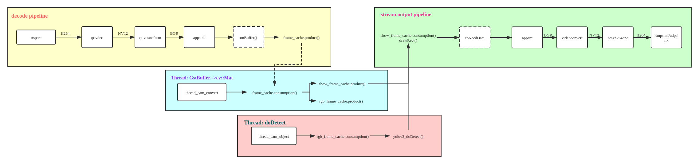
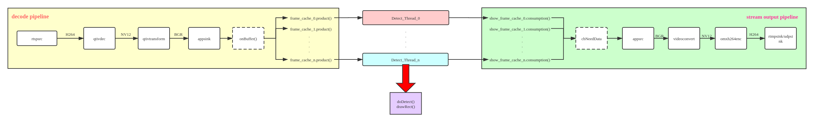

# Ericsson-Yolov3-SNPE

[TOC]

---

## 概述

最近在给客户做一个使用算法实时处理RTSP流并将处理后的图片帧推流至云端服务器的应用，同事写了个demo给客户，但客户在运行后反馈说程序存在内存泄露问题，我就看了看这套设计框架，以下简单做个分析。

### 文件树

```shell
.
├── CMakeLists.txt		# 工程CMake构建文件
├── inc
│   ├── TsCamera.h		# gstreamer camera类
│   └── TsProAndCon.h	# 生产者消费者队列模型
├── LICENSE
├── README.md
└── src
    └── TsCamera-rtmp.cpp	# 实现类
```

### 开发平台

- 操作系统：Ubuntu 18.04
- 开发框架：Gstreamer，OpenCV-4.2.0,
- 算法框架：SNPE（Qualcomm移动端DL开发框架）
- 算法模型：YoloV3（自训练定制模型）
- 构建工具：CMake

## 设计框架

算法部分涉及公司机密，并且我不是算法研发人员，因此此处略去算法细节，只在应用层面上讨论并行运行算法的可行性，整个程序目前迭代了两个版本，其中Version 1是同事开发的demo，Version 2是我的改进实现，之后预计会投入项目实用。

整个程序依托于Gstreamer框架，拉取IP Camera的RTSP视频流（delay<2s）经过解码，颜色转换后通过`Appsink`将`GstBuffer`送到应用程序内存空间的`cv::Mat`，然后给算法做处理，算法处理完之后使用OpenCV对图片帧画框，最后将`cv::Mat`通过`Appsrc`的回调函数拷贝回`GstBuffer`中进行编码推流，相关的完整pipeline如下：

```shell
[Camera CameraOne]gstreamer decoder pipeline string: rtspsrc location="RTSP_PATH" latency=500 tcp-timeout=500 drop-on-latency=true ntp-sync=true ! queue ! rtph264depay ! h264parse ! queue ! qtivdec  ! queue ! qtivtransform ! video/x-raw,format=BGR,width=1920,height=1080 ! appsink name=CameraOne sync=false caps=video/x-raw,format=BGR,width=1920,height=1080 
[Camera CameraOne]gstreamer display pipeline string: appsrc name=CameraOne_app stream-type=0 format=3 is-live=true  caps=video/x-raw,format=BGR,width=1920,height=1080 ! videoconvert ! video/x-raw,width=1920,height=1080,format=NV12 ! queue ! omxh264enc target-bitrate=4000000 interval-intraframes=25 quant-b-frames=0 control-rate=variable ! queue ! h264parse ! queue ! flvmux ! queue ! rtmpsink max-lateness=500000000 sync=false location="RTMP_PATH"
```

程序为了维持流的稳定传输，设计了一个生产者消费者模板类`TsProAndCon<T>`，用于完成图片帧的传递和同任务。

### Version 1

在v1中，程序维护了三个生产者消费者对象：appsink的`frame_cache`，appsrc的`show_frame_cache`，中间交换队列`rgb_frame_cache`。

整个程序的设计框架如下图：



- appsink的回调函数`onBuffer()`是`frame_cache`的生产者，程序不断拉流解码成图片帧送如`frame_cache`，这是图片帧运行在Gstreamer的内存空间内，具体为`GstBuffer`；

- Gstreamer pipeline运行的同时，设计了**额外的两个线程**，用于维护`rgb_frame_cache`:
  - `thread_cam_convert`：`frame_cache`的消费者，`rgb_frame_cache`和`show_frame_cache`的生产者
    - 不断从appsink的缓存中将图片帧从`GstBuffer`中拷贝成`cv::Mat`，其中`rgb_frame_cache`用于送算法，`show_frame_cache`送appsrc用于推流（做了两次拷贝）；
  - `thread_cam_object`：`rgb_frame_cache`的消费者，将其中的图片帧送算法处理，并将算法识别结果入队列；
- appsrc的回调函数`cbNeedData()`是`show_frame_cache`的消费者，将其中的图片帧取出做完画框工作后，拷贝回`GstBuffer`用于推流。

整个程序的框架属于常规的单线程思路，存在争议的地方在于单独开辟了两个线程用于算法运行，并且由此导致了两次memcpy，这一点其实是考虑到算法通常需要对输入的图片做resize工作，而显示需要和视频流的源尺寸保持一致，因此如果算法SDK本身没有去做resize工作，那么就需要你在送算法之前对图片帧做resize，所以需要单独维护一个队列去resize后送算法处理。

单线程的设计思想简单直观，假设性能允许的情况下，那么整个程序运行应该是没有问题的，但是经过实际测试，客户提供的算法单帧处理耗时为220ms左右，离需求25FPS的实时性能有比较大的差距，因此在appsink能够实现25FPS的生产速率的情况下，线程被block在`doDetect()`任务上，即`rgb_frame_cache`的消费速率远低于生产速度，那么对于内存的占用是非常可怕的：

```shell
1920 × 1080 dpi的RGB图片一帧需要6MB左右的内存
在v1的设计中，队列长度设计为10000，并且队列没有做丢帧处理，只是通过锁做阻塞
那么只需要1000帧，也即40s，就会消耗6GB左右的内存
对于SnapDragon 865的8GB内存来说，显然是不够用的
这就是客户所反映的内存泄露问题，实际不是内存泄漏，单纯是程序申请了过多的空间导致爆栈
```

算法使用的是Qualcomm的SNPE DL框架，根据之前开发的测试得知DSP实例最多可以起七个，AIP实例可以起10个，各个实例之间相互效率影响并不大，于是就想到通过并行运行算法，设计一个缓冲池，同时处理多张图片，再一次性送显示，于是就有了v2的设计。

### Version 2



进行算法单帧性能测试的时候，由于客户的算法模型性能实在过差，在后续的开发过程中换用了公司算法部门自训练定制的Yolo V3 SDK，实测性能单帧总耗时（包含SNPE init，网络加载，图片resize，运行，结果处理）为DSP：88ms，AIP：95ms。

这个设计存在的问题就是如何处理图片帧的顺序，确保流的时间戳是正确的，因此和v1不同，流从appsink出来后我使用switch-case对当前队列做判断，按顺序将sink出的图片帧放入指定的`frame_cache`队列，然后开辟的线程会从对应的`frame_cache`中取帧送算法，并且入队给指定的`show_frame_cache`，并且appsrc也使用了switch-case语句判断当前应该copy哪个队列中的帧。

测试中首先是开辟了6个DSP线程，DSP多线程运行似乎会导致性能损耗，从单线程单帧的88ms上升到了六线程六帧的240ms左右，也即平均40ms一帧，理论上使能满足25FPS，但是还需要考虑到opencv和少量memcpy的开销，因此实际测试消费速度还是略微跟不上生产速度，程序在运行一段时间后依然会积累很大的延迟，因此替换为AIP实例，六线程六帧的处理速度在80-120ms之间波动，也即一帧耗时在15-20ms之间，满足了性能需求。

## FAQ

1.程序的RTSP流地址从环境变量中读取：

```shell
export GST_RTSPSRC_PATH=rtsp:...
```

2.关于Gstreamer的Appsink/Appsrc的使用可以参考网上的相关资料，核心在于pipeline的构建以及回调函数的实现。

3.一种妥协的方案，允许视频做丢帧处理，在生产者消费者队列为满的时候进行出队。

4.图片缓冲池的设计比较粗糙，作为停止等待模型，使用简单的switch-case语句进行帧的顺序控制，耦合过高，有讨论过换用TCP模型，传递带帧号的图片帧报文。